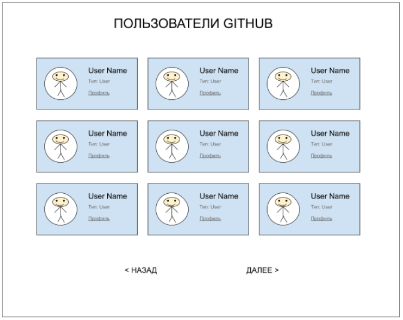
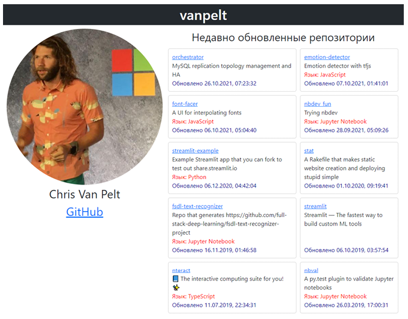

Для запуска приложения потребуется [Node.js c npm](https://nodejs.org) версии не ниже 16.15.0

После установки и клонирования репозитория, выполните в терминале команды
```
npm i
npm start
```

# Задание
Необходимо реализовать приложение, в котором будет отображаться перечень пользователей GitHub, который подтягивается с использованием API.

- На каждой карточке пользователя отображать его аватар, тип учётной записи.
- Реализовать пагинацию путём кнопок “Назад” и “Далее”.
- Реализовать отдельное представление (страницу) для каждого пользователя с подробной информацией о нём.

API: https://api.github.com/users  
Документация: https://developer.github.com/v3/users/

Пример, как может это выглядеть:



